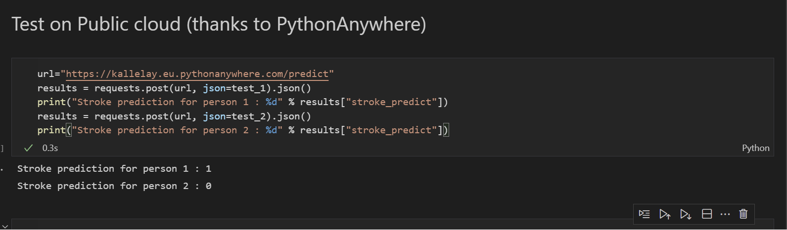

 # Documentation of Midterm project: Stroke prediction
by *Ahmed Yahia Kallel* for ML Zoomcamp.

 ---
 ### Academic honor code
 * _This work is original and is conducted individually. It has not been fully or partly copied with or without changes from any other place aside from the material from ML Zoomcamp. Any resemblance to other works is purely coincidental._
* _The final results are not very impressive. The work is done purely to demonstrate my capability to work with a database, clean it, analyze it, use different models with tuning, then deploy the model for prediction in local/local cloud/public cloud. Possible improvements could be to use other algorithms for a better classification. However, the guidelines say that it is sufficient to train and tune the models discussed in the courses (decision trees and linear models), which have been fulfilled during this work._
---


## Part 1: On the database, features analysis, and model selection

 ### Introduction
 A **Stroke** is a medical condition that may cause sudden death. In these cases, the movement ability of the patient reduces or even stops. The patient may also experience problems in speaking and understanding languages. If not treated in time, it will cause death [1]. In addition, stroke is correlated with high blood pressure, smoking, obesity, high blood cholesterol, and diabetes. 

**In this work, we propose to use the database in [2] to identify people who are likely to be suffering a stroke. And to identify the possible causes. The final output is a classification/boolean problem**


[1] https://en.wikipedia.org/wiki/Stroke  
[2] https://www.kaggle.com/fedesoriano/stroke-prediction-dataset  


  
  <br/>

 ### Database Description
The database in [2] contains 11 features *id, gender, age, hypertension, heart_disease, ever_married, work_type, resident_type, avg_glucose_level, bmi, smoking_status* and 1 output variable ***stroke*** (boolean). This database can be used to detect if the person is likely to have a **stroke** based on the aforementioned features and **5110 records**. It is downloaded from Kaggle [2] and is stored in [data/healthcare-dataset-stroke-data.csv](data/healthcare-dataset-stroke-data.csv).

[2] https://www.kaggle.com/fedesoriano/stroke-prediction-dataset

  <br/>
    
 ### Database Analysis
First analysis shows that the database contains **5110 medical observations** from **5110 unique patients**. The patients are **'Male' 'Female' 'Other'**, and are aged from **0 to 82**, with an average of 43. (See [notebook.ipynb](notebook.ipynb) for more info.).  

Among the 11 features, 10 are proven to be useful (all except "id"). 
* 3 features are numeric (bmi, age, avg_glucose_level)
* 5 categorical/boolean (gender*, hypertension, heart_disease, ever_married, residence_type) 
* 2 categorical/multivar (work_type,smoking_status). 

The full analysis of these features, their ranges, and their importance is depicted in [notebook.ipynb](notebook.ipynb). _Except 201 missing BMI values, which were replaced with 0, all the other features are fine_.


_*: All patients have either identified themselves as male or female, except 1 person._    
      
  
  <br/>

 ### Data preparation and model selection and tuning

 #### Implementation Details
 The database is split into 60% for training, 20% for validation, and 20% for testing using random_state=1.

 The correlation results shows that all of the selected 10 features seem to be uncorrelated, and therefore all of them are used in the classification. Feature importance analysis is done in [notebook.ipynb](notebook.ipynb). 

 In this project, I have tried 3 different classifiers:
 * Decision Tree Classifier
 * Random Forest Classifier 
 * Linear Regression (with different thresholds for classification). 
 
 For each classifier, **different combinations of parameters** are investigated with the purpose to find a compromise between:
 * Validation Precision
 * Area-under-Curve (AUC)
 * F1-Score

  <br/>
  
#### Results
Below are the results obtained following a classification. **It is shown that validation score is not sufficient for this database**. It should be accompanied with AUC and/or F1-Score. 

<table border="1" class="dataframe">
  <thead>
    <tr style="text-align: right">
      <th></th>
      <th>Method</th>
      <th>Validation</th>
      <th>AUC</th>
      <th>F1</th>
    </tr>
  </thead>
  <tbody>
    <tr>
      <th>0</th>
      <td>Decision Tree / max_depth=6</td>
      <td>0.95</td>
      <td>0.59</td>
      <td>0.26</td>
    </tr>
    <tr>
      <th>1</th>
      <td>Random Forest / max_depth=15, n_estimator = 7</td>
      <td>0.96</td>
      <td>0.56</td>
      <td>0.20</td>
    </tr>
    <tr>
      <th>2</th>
      <td>Linear / max_iteration = 100, C=10, threshold ...</td>
      <td>0.80</td>
      <td>0.75</td>
      <td>0.22</td>
    </tr>
  </tbody>
</table>

* **Eventually I have chosen Decision Tree with max_depth=6** as a compromise between classification speed, and overall performance as a classifier.


  <br/>

## Part 2: Documentation for futher use/analysis
Please check Part 3 for dependency and environment management before using the files.

### Playground: [notebook.ipynb](notebook.ipynb)
[notebook.ipynb](notebook.ipynb) is used for analyzing the database, correct the missing data, select different models, and tune their parameters. Further details are in Part 1 in [README.md](README.md)

* <span style="color:red;font-size:8pt">The database should be stored explicity in a separate folder (data) under [data/healthcare-dataset-stroke-data.csv](data/healthcare-dataset-stroke-data.csv)</span>.

### Training: [train.py](train.py) 
The logic of training is exported to  [train.py](train.py). This file contains the necessary information to load database, clean and fix database, and export the selected model (Decision Tree/max_depth=6.0) as a pickle file [model.bin](model.bin), together with the one-hot encoder [dv.bin](dv.bin).
* <span style="color:red;font-size:8pt">The database should be stored explicity in a separate folder (data) under [data/healthcare-dataset-stroke-data.csv](data/healthcare-dataset-stroke-data.csv)</span>.


### Prediction, deployed via web service Flask: [predict.py](predict.py) 
Flask application is deployed for the prediction in [predict.py](predict.py). In this file, the data is received as JSON string through POST via HTTP, under /predict through port 9696. It outputs a JSON string containg one output boolean variable __stroke_predict__.

 <br/>

## Part 3: Dependency and environment management

### pipenv
In order to assure cross-compatibility with other platforms/environments, pipenv has been deployed. <span style='color:red'>  **python 3.9** should be installed prior to use. (check instructions below for how) </span>. The pipenv requirements can be found in [Pipfile](Pipfile) and [Pipfile.lock](Pipfile.lock).

### Local deployment in Windows / Linux via Flask:
0. make sure that the following files exist in one folder (example "Midterm Project" in documents):
    * [Pipfile](Pipfile)
    * [Pipfile.lock](Pipfile.lock)
    * [predict.py](predict.py)
    * [model.bin](model.bin)
    * [dv.bin](dv.bin)
    * _(Optional for training) [data/healthcare-dataset-stroke-data.csv](data/healthcare-dataset-stroke-data.csv) AND [train.py](train.py)_

* **Make sure that pipenv is installed, check installing pipenv below to install pipenv.**

1. Open bash terminal (Linux) or command line (cmd, Windows) console
2. change directory to the directory where the files in step 0 are mentioned.   
    Example (Windows): 
    ```
    cd "C:\Users\kay_t\Documents\Midterm Project"
    ```

    Example (Linux):
    ```
    cd "/home/kallel/Documents/Midterm Project"
    ```
    <span style='font-size:8pt'>* Note in Linux, it is possible to use a file explorer such Nemo to navigate to the folder where the files are, right click anywhere and press "open in Terminal" to launch bash in the current path</span>

    <span style='font-size:8pt'>* Note in Windows, it is possible to use file explorer navigate to the folder, where the files are situated, and then in navigation current path (i.e., where the full path is shown), to select and remove the current path, write **cmd** and press enter to launch cmd in the current path</span>

3. Check that the current pipenv files are fine
    ```
    pipenv check
    ```
    (if this doesn't work, use this)
    ```
    python -m pipenv check
    ```
      <span style='font-size:8pt'>* Note in Windows, it is possible to use file explorer navigate to the folder, where the files are situated, and then in navigation current path (i.e., where the full path is shown), to select and remove the current path, write **cmd** and press enter to launch cmd in the current path

4. Probably not, so please install all the packages from pipfile.lock
    ```
    pipenv install
    ```
    (if this doesn't work, use this)
    ```
    python -m pipenv install
    ```    
    *(You can use "sync" instead of "install" if the file is not run for the first time, although sync and install seem to be similar)*  
    *Also you can check step 3 once more time*

5. run predict.py under pipenv settings:
    ```
    pipenv run python predict.py
    ```
        | If this doesn't work: use "pipenv shell", then "python predict.py"

<br/>

#### Installing Python 3.9
In case python 3.9 is not installed, and neither pyenv or asdf is installed, pipenv will fail. For this, it is possible to install Python 3.9 manually. Please use the following instructions to install it.

* For windows 10+: use **Microsoft Store to install python 3.9**
* For Linux (Debian):
    ```
    sudo apt-get install python3.9
    ```
    *I realized it too late, but instead of allowing >=3.9, I put it ==3.9. That means, even if you have a recenter/older python, but not pyenv or asdf, the pipenv env installation is likely to fail*

  
<br/>
  
#### Installing pipenv
In case pipenv is not installed, use this command to install it
```
pip install pipenv
```
(if this doesn't work use this instead:)
```
python -m pip install pipenv
```
  

  <br/>


## Part 4: Docker
To ensure a portability of the environment, [Dockerfile](Dockerfile) is added. The dockerfile is used to ensure that the pipenv previously discussed is correctly installed, together with gunicorn, and also deployed.

~***Note:*** *This guide is exclusively made for Linux (Debian-based), compatibility with other OS is not ensured*.

    *For Windows/MacOS users, please check the compatibility of the instructions below.   
    Otherwise, I recommend installing VirtualBox and install a Virtual Linux on it, for example Linux Mint or Ubuntu (Fast instructions just below)
 <span style='font-size:8pt'> *[instructions are: install VirtualBox, download a linux iso file, configure virtualbox machine, add the iso as a virtual optical drive (last instruction in the configuration), run machine, install OS, restart virtual machine, Menu Devices->Insert Guest Additions, run autorun.sh in Terminal (as sudo), restart virtual machine, Menu Devices->Shared Clipboard->Bidirectional, Menu Devices->Drag & Drop -> Bidirectional, copy the folder from git from Host (your pc) and paste it inside a folder in your virtual machine/alternatively drag and drop the folder from file explorer in the host (your pc) into the file explorer of your virtual machine*

## Building Docker
0. make sure that the following files exist in one folder (example "Midterm Project" in documents):
    * [Dockerfile](Dockerfile)
    * [Pipfile](Pipfile)
    * [Pipfile.lock](Pipfile.lock)
    * [predict.py](predict.py)
    * [model.bin](model.bin)
    * [dv.bin](dv.bin)
1. Open bash terminal (Linux) console
2. change directory to the directory where the files in step 0 are mentioned.   

    Example (Linux):
    ```
    cd "/home/kallel/Documents/Midterm Project"
    ```
    <span style='font-size:8pt'>* Note in Linux, it is possible to use a file explorer such Nemo to navigate to the folder where the files are, right click anywhere and press "open in Terminal" to launch bash in the current path</span>


3. build docker image "project" in the same folder
    ```
    docker build -t project .
    ```
    In case of a permission error, use
    ```
    sudo docker build -t project .
    ```
    * **Important, the "dot" . is important and it says that this is the current path**


## Run Docker Image

1. Open bash terminal (Linux) console
2. run the following command
    ```
     docker run -it --rm -p 9696:9696 project
    ```
    In case of a permission error, use:
    ```
     sudo docker run -it --rm -p 9696:9696 project
    ```
Make sure that you have already the Docker image built beforehand.


  <br/>


## Part 5: Cloud Deployment

### Deployment
For the deployment, I have used https://eu.pythonanywhere.com/ (free limited version: maximum 100s daily before "tarpit"). 

* After registration, a new webapp was created from the main dashboard. 
* The main route of webapp is configured to access "predict.py" (dummy file) as a main file
* In Source code from dashboard, the following files were uploaded:
    * Pipfile
    * Pipfile.lock
    * dv.bin
    * model.bin
    * predict.py (overwritten)

<br/>

### Public endpoint
The public endpoint is:  https://kallelay.eu.pythonanywhere.com/predict

The last cell and the cell before the last in [notebook.ipynb](notebook.ipynb) gives an example of test data as well as code for direct use.

<br/>


### Fallback (in case of tarpit problem)
In case of tarpit error (due to 100% usage in the limited version of pythonanywhere), you can still see a screenshot of the cloud deployment solution. 


As well as a youtube demonstration video:
[https://youtu.be/CXKjaZeIvcw](https://youtu.be/CXKjaZeIvcw)

